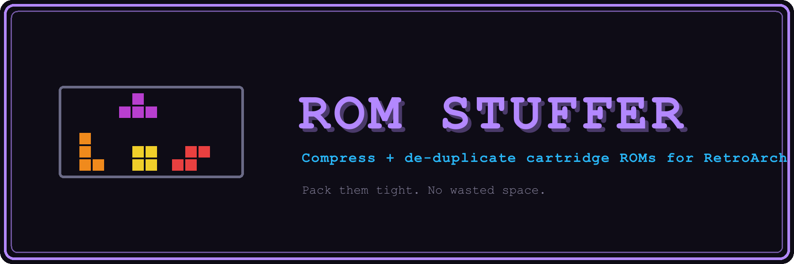
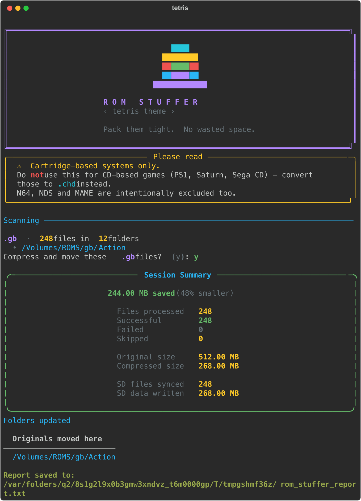
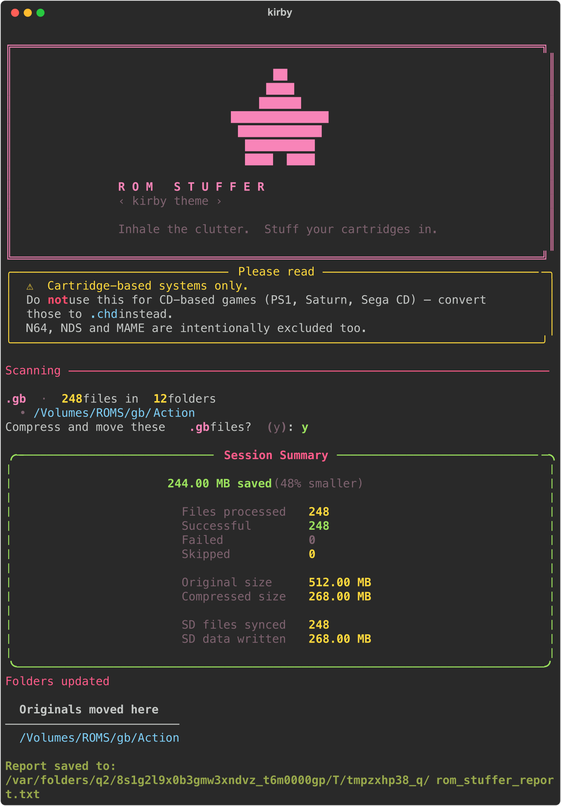
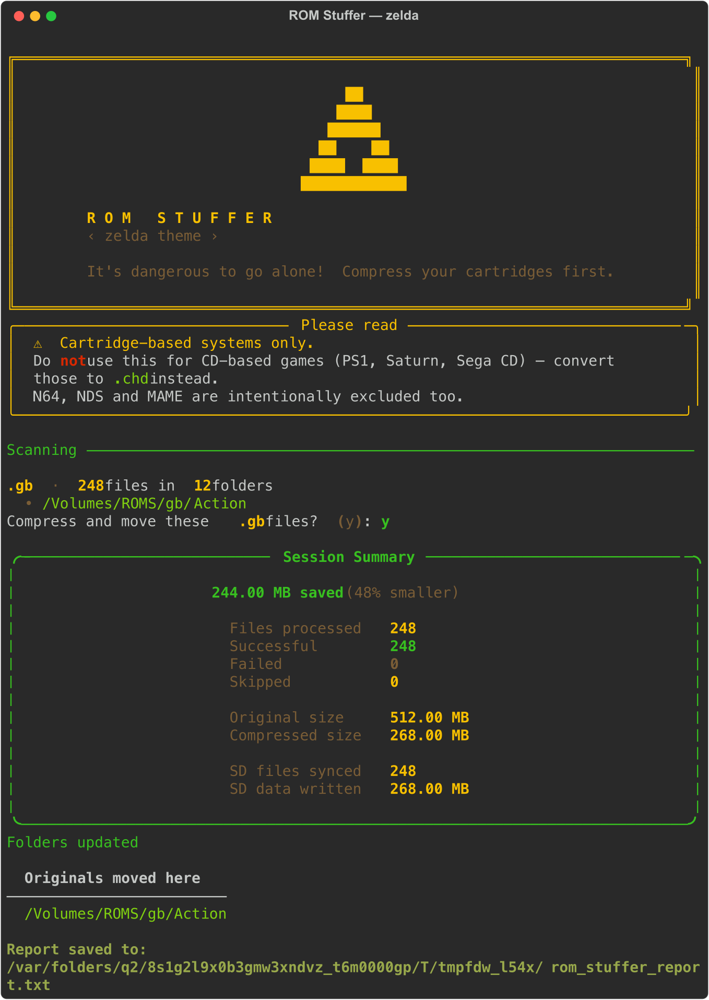
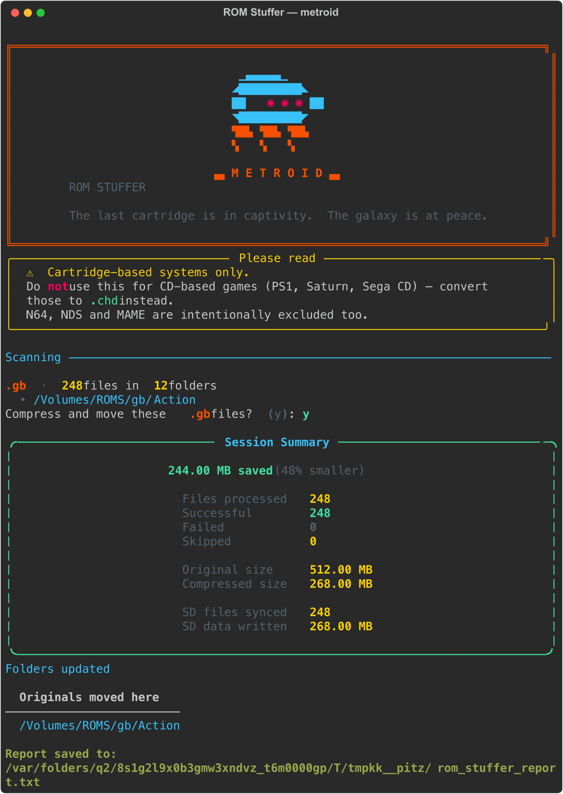

<div align="center">



<br>


**▲  Compress retro cartridge ROMs into RetroArch-ready `.zip` archives — with an 8-bit terminal UI.  ▲**

</div>

<div align="center"></div>

`rom_stuffer` is a command-line Python utility that streamlines managing retro gaming ROMs. It recursively scans a directory for cartridge ROM files, compresses each game into its own highly-compatible `.zip` archive, and safely moves the original uncompressed files to a backup location while perfectly preserving your folder structure.

It is built for preparing SD cards for retro handheld consoles (R36S, R36XX, Ayn Thor, Miyoo Mini, etc.) running RetroArch-based systems (ArkOS, AmberELEC, OnionOS).

**Repository:** [https://github.com/Tasogarre/rom-stuffer](https://github.com/Tasogarre/rom-stuffer)

---

## ⚠️ CRITICAL WARNING: Cartridge-Based Systems Only!

This script is designed **exclusively** for cartridge-based systems, such as:
- Nintendo Entertainment System (NES)
- Super Nintendo (SNES)
- Game Boy / Game Boy Color / Game Boy Advance (GB, GBC, GBA)
- Sega Genesis / Mega Drive

**DO NOT** use this script for CD-based games (e.g., PlayStation 1, Sega Saturn, Sega CD, Dreamcast). Emulators do not efficiently read large disc images (`.bin`/`.cue`, `.iso`) from `.zip` files. Doing so will result in massive load times, audio stuttering, or complete crashes. For CD-based games, use a tool like `chdman` to convert them to `.chd` format instead.

---

## Why Use This?

1. **Saves SD Card Space:** Compresses your ROMs using standard DEFLATE compression.
2. **Optimised for Emulators:** Emulators hate "solid" archives or ZIPs with multiple games in them. `rom_stuffer` ensures every single ROM gets its own individual `.zip` file, which is exactly what RetroArch expects.
3. **Fast Decompression:** Uses "Normal" compression level (6) rather than "Ultra." This ensures that lower-powered handhelds can decompress the game on-the-fly without stuttering.
4. **Organised Backups:** Moving your uncompressed files into a single dump folder is messy. `rom_stuffer` recreates your exact subdirectory structure in the backup folder automatically.
5. **SD Card Fast-Sync:** Built-in sequential 4 MB-buffered bulk I/O allows you to reconcile newly compressed files directly to your SD card. It auto-deletes the old uncompressed files, writes the new zip, and fsyncs to confirm the data is durable.
6. **Detailed Reporting:** Calculates space saved, lists exactly which folders were modified, and outputs a detailed report to the screen (via a Rich TUI) and to a text log file.
7. **Resumable:** Checkpoints progress as it goes, so an interrupted run over tens of thousands of files picks up where it left off instead of rescanning your whole library. See [Resuming an interrupted job](#resuming-an-interrupted-job).

---

## ▲ Preview

<div align="center">



<sub>The interactive UI in the default **tetris** theme — switch any time with `--theme kirby|zelda|metroid`. See [Themes](#themes).</sub>

</div>

<div align="center"></div>

## Requirements

- **OS:** Windows, macOS, or Linux
- **Python:** 3.8 or higher
- **Dependencies:** The `rich` library (`pip install -r requirements.txt`)

---

## Quick Start

Five commands from zero to your first compressed batch:

```bash
# 1. Clone the repository
git clone https://github.com/Tasogarre/rom-stuffer.git
cd rom-stuffer

# 2. Install the single dependency
pip install -r requirements.txt

# 3. Preview what will happen (no files are modified)
python compress_roms.py \
  --source "/path/to/your/roms" \
  --dest "/path/to/your/backup" \
  --dry-run

# 4. Run for real (interactive — the script will ask about each extension it finds)
python compress_roms.py \
  --source "/path/to/your/roms" \
  --dest "/path/to/your/backup"

# 5. Or target a single extension headlessly
python compress_roms.py \
  --source "/path/to/your/roms" \
  --dest "/path/to/your/backup" \
  --type .gba
```

> **Windows users:** Use `python` or `py` instead of `python3`, and wrap paths in double quotes:
> `python compress_roms.py --source "E:\ROMS" --dest "D:\RetroBackups"`

---

## SD Card Setup

### Step 1 — Find your SD card path

**macOS:**
```bash
# List all disks; look for your SD card (e.g. "disk2s1")
diskutil list

# The mount point is usually under /Volumes/
ls /Volumes/
# e.g. /Volumes/SDCARD  or  /Volumes/ROMS
```

**Linux:**
```bash
# List block devices and their mount points
lsblk -o NAME,SIZE,FSTYPE,MOUNTPOINT

# SD cards are typically mounted under /media/ or /mnt/
ls /media/$USER/
# e.g. /media/marcus/SDCARD
```

**Windows:**
```
Open File Explorer → This PC
Note the drive letter assigned to the SD card (e.g. F:\)
```

### Step 2 — Understand the folder structure

`rom_stuffer` preserves your relative directory tree. If your PC ROMs are at:
```
C:\MyROMs\gba\Mario.gba
C:\MyROMs\snes\Zelda.sfc
```
After running with `--sdcard F:\`:
- Your PC: `C:\MyROMs\gba\Mario.zip` (the new zip)
- Your backup: `D:\Backup\gba\Mario.gba` (the original, safely moved)
- Your SD card: `F:\gba\Mario.zip` (synced to the card)

The SD card's old `F:\gba\Mario.gba` is deleted **before** the new zip is written. This is intentional — cards are often nearly full and cannot hold both at once. The zip already exists locally, so the card is always recoverable by re-running.

> [!NOTE]
> **Same-named games:** If two ROMs in the same folder share a name but differ in extension (e.g. `Mario.gb` and `Mario.gbc`), they would both map to `Mario.zip`. To avoid silently overwriting one, the second gets a disambiguated name: `Mario.zip` and `Mario_gbc.zip`. The ROM's real filename is preserved *inside* the archive, so emulators still load it correctly. This also protects any pre-existing `.zip` already in the folder from being overwritten.

### Step 3 — Run with SD sync

```bash
# macOS example
python compress_roms.py \
  --source "/Users/marcus/ROMs" \
  --dest "/Users/marcus/ROMs_backup" \
  --sdcard "/Volumes/SDCARD"

# Windows example
python compress_roms.py \
  --source "C:\MyROMs" \
  --dest "D:\Backups" \
  --sdcard "F:\"

# Linux example
python compress_roms.py \
  --source "/home/marcus/roms" \
  --dest "/home/marcus/roms_backup" \
  --sdcard "/media/marcus/SDCARD"
```

> **Space note:** The script deletes the old uncompressed file from the SD card first, then copies the new `.zip`. This is by design for nearly-full cards. The new zip is always written to your PC first, so you can safely re-run if anything interrupts the SD sync.

> **After the run:** Safely eject your SD card before unplugging it. On macOS: right-click the volume in Finder → Eject. On Linux: `sudo umount /media/marcus/SDCARD`.

---

## Usage

By default, `rom_stuffer` runs in **Interactive Mode** (a styled terminal UI). Launch it with no arguments and it walks you through every option — no flags to remember:

```bash
python compress_roms.py
```

It prompts for: **source** and **destination** directories, **dry-run** (preview) mode, **recursive** scanning, **compression level** (1–9, default 6), and **SD card** sync. It then scans, groups the ROMs it finds by extension, and asks whether to compress each type. If a previous run was interrupted, it also offers to [resume](#resuming-an-interrupted-job). Any option you prefer to set up front can be passed as a flag instead (see the table below); anything you don't pass is asked interactively.

```bash
# Or pass what you know and be prompted for the rest
python compress_roms.py --source "<source_directory>" --dest "<backup_directory>"
```

### CLI Arguments

| Argument | Short | Description |
| :--- | :--- | :--- |
| `--source` | `-s` | **(Required)** The directory to scan for ROMs. The script searches recursively through all subfolders by default. |
| `--dest` | `-d` | **(Required)** The destination directory where the original, uncompressed files will be safely moved. Must differ from `--source`. |
| `--type` | `-t` | **(Optional)** A specific file extension to target (e.g. `.gba`). Bypasses interactive prompts and processes only that extension. |
| `--sdcard` | `-sd` | **(Optional)** SD card directory to sync newly compressed `.zip` files to. Old uncompressed versions on the card are automatically deleted first. |
| `--dry-run` | | **(Optional)** Preview what will happen without modifying any files. Space savings in the report are estimates. |
| `--no-recursive` | | **(Optional)** Scan only the top-level source folder; do not descend into sub-folders. |
| `--level` | `-l` | **(Optional)** DEFLATE compression level 1–9. Default: `6` (Normal). Level 6 is the recommended balance for RetroArch handhelds — do not go higher without testing on your device. |
| `--resume` | | **(Optional)** Resume a previously interrupted job from its saved progress, skipping the full rescan. See [Resuming an interrupted job](#resuming-an-interrupted-job). |
| `--fresh` | | **(Optional)** Discard any saved progress in the destination and start a brand-new scan. |
| `--theme` | | **(Optional)** Visual theme: `tetris` (default), `kirby`, `zelda`, or `metroid`. See [Themes](#themes). |
| `--help` | `-h` | Show the help menu and exit. |

---

## Themes

The interactive UI ships with four retro 8-bit skins, each with an original pixel-art emblem and its own palette. Launch with no arguments and it asks which you'd like; or pick one up front with `--theme`:

```bash
python rom_stuffer.py --theme tetris     # tetromino board (default)
python rom_stuffer.py --theme kirby      # pink star
python rom_stuffer.py --theme zelda      # gold triangle emblem
python rom_stuffer.py --theme metroid    # bio-cyan creature
```

Each theme re-skins the entire interface — banner, panels, section rules, progress bars, and summary colours. Emblems are original geometric pixel-art, not reproductions of any character.

**Want your own emblem art?** Drop a pixel image you have the rights to and it becomes the emblem — no code changes. See [Supplying your own theme art](docs/THEME_ART.md).

<table>
<tr>
<td width="50%" align="center">

**`tetris`** *(default)*<br>
<sub>Tetromino board · "Pack them tight."</sub>


</td>
<td width="50%" align="center">

**`kirby`**<br>
<sub>Pink pixel star · "Inhale the clutter."</sub>



</td>
</tr>
<tr>
<td width="50%" align="center">

**`zelda`**<br>
<sub>Gold triangle emblem · Link-green</sub>



</td>
<td width="50%" align="center">

**`metroid`**<br>
<sub>Samus-orange · bio-cyan creature</sub>



</td>
</tr>
</table>

<div align="center"></div>

## Resuming an interrupted job

For large collections (tens of thousands of files), a run can be interrupted — a full SD card, an unplugged drive, a `Ctrl-C`, or a crash. **rom_stuffer checkpoints its progress so it can pick up where it left off without rescanning your entire library.**

### How it works

As soon as processing begins, the tool writes two small hidden files into your **destination** (backup) folder:

- `.rom_stuffer_state.json` — the full list of files this job will process.
- `.rom_stuffer_journal.log` — an append-only record of every file completed so far (flushed after each file, so an interruption loses nothing).

If a run is interrupted, these files remain. The next run detects them.

### Resuming (interactive)

Just run the same command again. The tool notices the incomplete job and asks:

```
Found an incomplete job in this destination:
  source:   /Volumes/ROMS
  progress: 22,431 / 40,002 done  (17,571 remaining)
Resume where it left off (skip the full rescan)? [y/n] (y):
```

Answer **y** and it processes only the remaining files — no rescan, no re-prompting for which extensions to compress.

### Resuming (headless / scripted)

Pass `--resume` to skip the prompt, or `--fresh` to ignore the saved progress and start over:

```bash
# Continue the interrupted job
python compress_roms.py -s "/Volumes/ROMS" -d "/backup" -sd "/Volumes/SDCARD" --resume

# Or throw away the saved progress and rescan from scratch
python compress_roms.py -s "/Volumes/ROMS" -d "/backup" --fresh
```

### Good to know

- **Files that failed are retried, not skipped.** If some files errored (e.g. a momentary card disconnect), the saved progress is kept and the summary tells you to re-run with `--resume` to retry just those. Successful files are never reprocessed.
- **On a clean finish the state files are removed automatically** — no manual cleanup.
- **The saved job is tied to its source.** If you point a *different* source at a destination that already has a saved job, the tool refuses (to avoid mixing two jobs) and tells you to use `--fresh` or a different destination.
- **Dry runs never write state**, since they change nothing.

---

## Supported Extensions

The built-in library recognises the following cartridge ROM extensions automatically:

- **Nintendo:** `.nes`, `.sfc`, `.smc`, `.fig`, `.swc`, `.gb`, `.gbc`, `.gba`, `.fds`, `.vb`, `.vboy`, `.min`, `.mgw`
- **Sega:** `.bin`, `.gen`, `.md`, `.smd`, `.sms`, `.gg`, `.sg`, `.32x`
- **NEC:** `.pce`, `.sgx`
- **Atari:** `.a26`, `.a52`, `.a78`, `.j64`, `.lnx`, `.atr`, `.atx`, `.xfd`, `.xex`, `.cas`, `.st`
- **Commodore:** `.crt`, `.d64`, `.t64`, `.prg`, `.tap`, `.d81`, `.g64`
- **Amiga:** `.adf`, `.dms`, `.fdi`, `.ipf`, `.hdf`, `.hdz`
- **Home Computers:** `.msx`, `.rom`, `.dsk`, `.z80`, `.tzx`, `.cdt`
- **Other:** `.ws`, `.wsc`, `.ngp`, `.ngc`, `.col`, `.int`, `.vec`, `.chf`, `.o2`

> [!IMPORTANT]
> **`.bin` is handled with care.** The `.bin` extension is used both by Sega Genesis / Atari 2600 **cartridge** dumps (safe to compress) *and* by CD/GD-ROM **disc images** (PS1, Saturn, Sega CD, **Dreamcast**, PC Engine CD) and **BIOS** files (never safe). rom_stuffer automatically **refuses** a `.bin` when it looks like a disc image or BIOS — if it sits in a disc-system or `bios` folder, has a companion `.cue`/`.gdi` descriptor, or is larger than a cartridge could be (>16 MB) — and lists the reason in the report. Genuine cartridge `.bin` dumps are still compressed normally.

> [!NOTE]
> **CD-Based Systems Exclusion:** Disc images (PS1, Sega CD, Saturn, Dreamcast) are completely excluded. Emulators must seek and stream large tracks directly from the file, and `.zip` extraction overhead will cause severe stuttering. Use `.chd` format instead.

> [!NOTE]
> **N64 / NDS Exclusion:** Nintendo 64 and Nintendo DS extensions are explicitly excluded. The overhead of extracting these larger files from `.zip` archives on lower-powered devices can severely exacerbate audio/video stuttering.

> [!NOTE]
> **MAME / Arcade Exclusion:** Arcade ROMs are not supported by this tool because they are already distributed and required to be in `.zip` or `.7z` format by default. You should never decompress MAME ROMs.

---

## Examples

### Example 1: Interactive Scan (Recommended for first run)

Scanning your entire ROMs folder and backing up originals to an external drive:

```bash
python compress_roms.py --source "E:\ROMS" --dest "D:\RetroBackups\Uncompressed"
```

The script will find `.gba` games, list the folders they are in, ask if you want to compress them, then move on to `.nes`, `.sfc`, etc.

### Example 2: Headless / Automated Usage

Bypass the interactive prompts and compress only a specific format (e.g. SNES):

```bash
python compress_roms.py -s "E:\ROMS\snes" -t ".sfc" -d "D:\Backups\snes_raw"
```

**Result:**
- `E:\ROMS\snes\Action\Super Metroid.zip`
- `D:\Backups\snes_raw\Action\Super Metroid.sfc` (original safely moved)

### Example 3: Full SD Card Fast-Sync

Compress your local PC ROMs, back up the originals locally, and push the new `.zip` files directly to your inserted SD card:

```bash
python compress_roms.py -s "C:\MyROMs" -d "D:\RetroBackups" -sd "F:\"
```

The script will:
1. Find `C:\MyROMs\gba\Mario.gba`
2. Compress it to `C:\MyROMs\gba\Mario.zip`
3. Delete `F:\gba\Mario.gba` from the SD card (to free space)
4. Copy `Mario.zip` to `F:\gba\Mario.zip` using a 4 MB sequential buffer and fsync
5. Move `C:\MyROMs\gba\Mario.gba` to `D:\RetroBackups\gba\Mario.gba`

### Example 4: Dry Run Before Committing

Always preview before running on a large collection:

```bash
python compress_roms.py \
  -s "/Volumes/SDCARD/roms" \
  -d "/Users/marcus/roms_backup" \
  --dry-run
```

No files are touched. The report shows estimated space savings and which folders would be affected.
