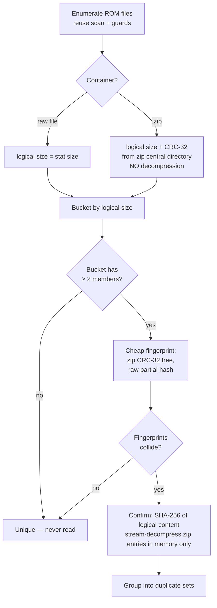

# ROM Stuffer — Design

**Status:** design of record for the multi-capability expansion.
**Created:** 2026-07-17.

## 1. Vision

One goal drives everything: **fit the maximum number of playable games onto an
SD card for RetroArch-based handhelds.** "Stuffing more ROMs onto the card" is the
unifying metaphor, and it has three levers:

| Lever | How it stuffs | Status |
| :--- | :--- | :--- |
| **Compress** | shrink each ROM to a `.zip` | shipped |
| **De-duplicate** | remove byte-identical copies | **phase 1 (this design)** |
| **Curate & sync** | copy only the systems you choose, with space estimates | phase 2 |

The name **ROM Stuffer** covers all three and gets more apt as it grows.

---

## 2. Why one app, not two

De-duplication is a sibling of compression, not a separate tool. It reuses almost
everything already built:

- recursive scanning and the extension allowlist
- **the disc-image / BIOS safety guards** (`exclusion_reason`) — dedup must never
  hash-and-move a Dreamcast disc or a BIOS any more than compression may
- the Rich TUI, theming, reporting, the plain-text report, the live space readout
- the "move to a backup dir, never destroy" safety posture
- the resume manifest/journal (valuable for hashing tens of thousands of files)
- the SD-card sync target

A second app would re-implement all of that. Dedup lands **inside** ROM Stuffer as
a new capability.

---

## 3. Architecture

### 3.1 Package layout

`compress_roms.py` (~1,000 lines) is split into a small package. The entry point is
renamed to `rom-stuffer.py`; `compress_roms.py` remains as a thin deprecation shim.

```
rom-stuffer.py            # entry point: delegates to rom_stuffer.cli:main
compress_roms.py          # deprecation shim: prints a notice, forwards to the CLI
rom_stuffer/
  __init__.py
  __main__.py             # `python -m rom_stuffer`
  cli.py                  # argparse subcommands + no-arg interactive menu
  tui.py                  # console, panels, prompts, section rules, header
  themes.py               # THEME registry + emblem art (kirby default, zelda, metroid, tetris)
  guards.py               # SUPPORTED_EXTENSIONS, DISC_SYSTEM_FOLDERS, exclusion_reason, describe_error
  scan.py                 # recursive scan + per-extension grouping
  metrics.py              # SessionMetrics, format_size
  report.py               # generate_reports
  state.py                # ResumeState, manifest/journal (shared by compress + dedup)
  compress.py             # build_zip_path, compress_batch, fast_sd_copy
  hashing.py              # logical-content hashing (raw + zip), size/CRC prefilter
  dedup.py                # duplicate detection + keeper rules
  planfile.py             # dedup plan + hash index: model, save/load
  review.py               # TUI plan review / edit / apply
```

The split is behaviour-preserving for `compress`: existing tests and flows keep
working; only import paths move.

### 3.2 CLI shape

Subcommands for headless use, an interactive menu when launched with no arguments
(the TUI is the primary interface).

```
python rom-stuffer.py compress -s ... -d ...        # today's behaviour
python rom-stuffer.py dedup    -s ... -d ...
python rom-stuffer.py                               # → menu:
    What would you like to do?
      [1] Compress
      [2] Find duplicates
      [3] Both  (de-duplicate, then compress)
```

Shared flags (`-s/--source`, `-d/--dest`, `-sd/--sdcard`, `--dry-run`, `--theme`,
resume flags) live on a common parser; each subcommand adds its own.

---

## 4. De-duplication design (phase 1)

### 4.1 What counts as a duplicate

**Byte-for-byte identical ROM content only.** This catches the same ROM saved under
different filenames (`Sonic.md` vs `Sonic the Hedgehog (World).md`) or copied into
several folders. Out of scope for phase 1: regional/version variants (`(USA)` vs
`(Europe)`) — those are different ROMs and need fuzzy/DAT-based matching later.

**Key property:** because only identical bytes are ever removed, whichever copy is
kept is *the same game*. The only thing at stake is the **filename and folder**, not
playability — a low-risk failure mode that shapes the whole fidelity model (§4.4).

### 4.2 Logical-content hashing (the 124 GB problem)

The library is mixed: some ROMs are raw, some already compressed to `.zip`. Dedup
must compare the **logical ROM content** regardless of container, **without
mass-unzipping**.



Why this is cheap on 124 GB:

- **Bucket by *logical* (uncompressed) size first.** A raw file's size is one `stat`;
  a zip stores its entries' uncompressed size in the central directory. Unique sizes
  are eliminated with zero content reads.
- **Zips ride on metadata.** A zip's stored **CRC-32** and uncompressed size come
  from the directory — no decompression to bucket or pre-filter.
- **Only true candidates are read.** SHA-256 is computed only for files that survive
  the size + CRC pre-filter, and zip entries are **streamed and hashed in memory**,
  never extracted to disk. Peak memory stays constant.

**On "which platforms must stay zipped":** within ROM Stuffer's supported scope
(cartridge systems), every system loads fine from `.zip` — that is the compression
premise. So there is no per-platform unzip constraint to manage. Dedup does not
change any file's zip/raw state; it only removes redundant copies. (Systems that
*must* remain zipped — arcade/MAME — and disc systems are already excluded by the
guards.)

### 4.3 The hash index (feeds phase 2)

Hashing produces a durable **hash index**: for each ROM, its logical SHA-256, its
**logical (uncompressed) size**, and its **stored (on-disk) size** — which differ for
zips. Phase 2's per-system space estimator reads this index to project SD-card
footprint per system, **differentiating compressed vs decompressed size**, so the
user can decide what to sync. Phase 1 builds and persists the index; phase 2 consumes
it.

### 4.4 Keeper selection and fidelity ("plan → review → apply")

Because only the name/location is ever at stake (§4.1), the right fidelity is
**rule-based defaults + a reviewable, editable plan** — not per-file prompting.

- **Default keeper heuristic** (deterministic, reproducible): prefer a copy *not* in
  junk folders (`dupes/`, `backup/`) or with `(1)`/`copy` names; prefer a clean
  No-Intro-style name; prefer the already-**compressed** copy (smaller); prefer the
  shallowest path; tie-break by first path alphabetically.
- **Global knobs** tune the rule once instead of per group: `--keeper-order`
  (folder-priority list), `--protect <folder>` (never removed / always preferred),
  `--per-system` (only dedup within one system folder), `--min-size`.
- **The plan is reviewed and edited inside the TUI** (primary interface): browse
  duplicate groups, change a keeper, skip a group, then apply. Per-group prompting is
  offered only for small runs (`--interactive`); a persisted plan file backs
  resume/audit and headless apply.

### 4.5 Removal and safety

- **Removal mode is chosen at runtime:** quarantine (move to a dedup-backup folder,
  preserving structure — reversible) is the default; hard-delete is opt-in via a
  runtime prompt / flag.
- **Reuse the disc/BIOS guards** — dedup never touches BIOS or disc images.
- **Dedup defaults to preview** (it removes files), producing the plan first.
- **Dry-run** reports what would be removed + space reclaimed, touching nothing.

### 4.6 Ordering

Dedup runs **before** compression. Hashing is on raw content, and two zips of an
identical ROM may not be byte-identical (metadata/timestamps), so dedup compares
logical content and the "Both" flow is: **de-duplicate → compress → (sync)**.

---

## 5. Themes

Kirby becomes the **new default and the repo's primary identity** — its inhale /
absorb / consume motif fits "stuff more in, remove the redundant." Zelda and Metroid
remain (the Metroid emblem gets an upgrade); **Tetris** is added as the theme that
best captures the packing identity.

All emblems are **original, simple homage pixel-art** built in the theme's spirit
(e.g. a pink puffball, a tetromino stack) — the same approach as the existing
Triforce and Metroid-creature emblems. No third-party or character artwork is copied
or committed; the reference images are inspiration only.

The theme mechanism is unchanged: a `THEMES` registry maps a name to a semantic
palette + emblem; `apply_theme()` re-skins everything. Only the default changes and
two entries are added/upgraded.

---

## 6. Phase 2 (out of scope now, designed-for)

- **Per-system space estimator** built on the §4.3 hash index: for each system, show
  raw size, estimated compressed size, and dedup savings, so the user can pick what
  fits.
- **Selective SD sync** by system, with a running "fits in X of Y GB" budget.

Phase 1 deliberately produces the hash index in the shape phase 2 needs.

---

## 7. Non-goals (phase 1)

- Fuzzy / name-based / DAT-based dedup of *variants* (only byte-identical).
- Converting between raw and zip during dedup (that is compression's job).
- The phase-2 estimator and selective sync UI.
- Any change to the disc/BIOS exclusion policy.
